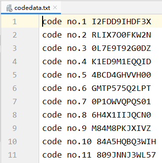
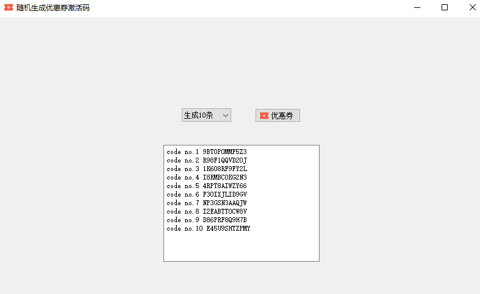
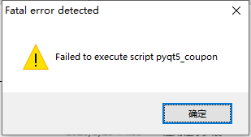

### 1.描述

- 使用Python生成200个优惠券激活码

### 2.思路

#### （1）引入Faker

- password()方法如下

  ```python
  password()：随机生成密码
  # 如下是可选参数，默认为True：
  length：密码长度,
  special_chars：是否能使用特殊字符,
  digits：是否包含数字,
  upper_case：是否包含大写字母,
  lower_case：是否包含小写字母。
  ```

- 由大写字母、数字，生成长度为12位的随机数
```python
fake.password(length=12, special_chars=None, lower_case=None)
```

#### （2）保存到文本中

```python
codedata = open('codedata.txt', 'a+')
codedata.write(data)
codedata.close()
```

### 3.完整代码

```python
'''
Function:
	使用 Python 生成 200 个激活码（或者优惠券）
Author:
	Eleven
微信公众号:
	ElevenKeep
编写日期:
	2020-07-28
'''
from faker import Faker


def coupon_code():
    fake = Faker()
    # 随机生成200个
    for count in range(200):
        count += 1
        data = 'code no.' + str(count) + ' ' + fake.password(length=12, special_chars=None, lower_case=None) + '\n'
        # 将数据写入到txt文件中
        codedata = open('codedata.txt', 'a+')
        codedata.write(data)
        codedata.close()


if __name__ == '__main__':
    coupon_code()

```

- 运行结果



### 4.（无需Python环境）做成可视化exe文件



- 完整代码

```python
'''
Function:
	使用 Python 生成 200 个激活码（或者优惠券）
Author:
	Eleven
微信公众号:
	ElevenKeep
说明：
    ui文件和图片请关注微信公众号ElevenKeep，回复Python01获取
编写日期:
	2020-07-28
'''
from PySide2.QtUiTools import QUiLoader
from PySide2.QtWidgets import QApplication,QMainWindow,QMessageBox
from faker import Faker
from PySide2.QtGui import QIcon


fake = Faker(locale='zh_CN')
class Data(QMainWindow):

    def __init__(self):
        self.ui = QUiLoader().load('coupon.ui')
        self.ui.coupon.clicked.connect(self.coupon_code)
        self.ui.coupon.setIcon(QIcon("coupon.png"))
        self.ui.button.currentIndexChanged.connect(self.coupon_code())
        self.ui.setWindowTitle("随机生成优惠券激活码")

    def coupon_code(self):
        self.ui.text.clear()    # 每次生成前，都清空文本框
        key = self.ui.button.currentText()    # 获取下拉框的值
        try:
            if key == "生成10条":
                for count in range(10):
                    count += 1
                    self.ui.text.appendPlainText('code no.' + str(count) + ' ' + fake.password(length=12, special_chars=None, lower_case=None))
            elif key == "生成50条":
                for count in range(50):
                    count += 1
                    self.ui.text.appendPlainText(
                        'code no.' + str(count) + ' ' + fake.password(length=12, special_chars=None, lower_case=None))
            elif key == "生成100条":
                for count in range(100):
                    count += 1
                    self.ui.text.appendPlainText(
                        'code no.' + str(count) + ' ' + fake.password(length=12, special_chars=None, lower_case=None))
            elif key == "生成200条":
                for count in range(200):
                    count += 1
                    self.ui.text.appendPlainText(
                        'code no.' + str(count) + ' ' + fake.password(length=12, special_chars=None, lower_case=None))
            else:    # 默认自动生成1条
                self.ui.text.setPlainText('code no.' + str(1) + ' ' + fake.password(length=12, special_chars=None, lower_case=None))
        except:
            QMessageBox.critical(
                self.ui,
                '错误',
                '系统奔溃了 (*•̀ㅂ•́)，重启下试试(ง •̀_•́)ง！')

app = QApplication([])
app.setWindowIcon(QIcon("coupon.png"))#图标地址信息
stats = Data()
stats.ui.show()
app.exec_()
```

### 5.常见问题

##### （1）双击exe文件报错



- 解决方法：

需要将ui文件复制到exe同级目录中。

##### （2）没有显示图片


- 解决方法：

将图片复制到exe同级目录中，也可以自己随便指定一张图片，但是名字一定是`coupon.png`，否则不会加载。