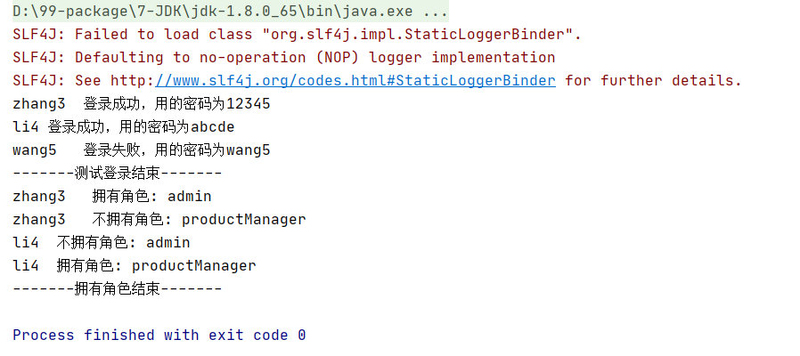

## 一、Shiro

### 1.shiro

用于`用户验证`和`授权操作`。

### 2.案例

项目总体图


#### 1）shiro.ini

在`src目录`下新建 `shiro.ini`
这里面定义了和安全相关的数据： `用户，角色和权限`新建lib文件夹

引入shiro和slf4j jar包（移步github拷贝）

```java
#定义用户
[users]
#用户名 zhang3  密码是 12345， 角色是 管理员
zhang3 = 12345, admin
#用户名 li4  密码是 abcde， 角色是 产品经理
li4 = abcde,productManager
#定义角色
[roles]
#管理员什么都能做
admin = *
#产品经理只能做产品管理
productManager = addProduct,deleteProduct,editProduct,updateProduct,listProduct
#订单经理只能做订单管理
orderManager = addOrder,deleteOrder,editOrder,updateOrder,listOrder
```

#### 2）User

准备用户类，用于存放账号密码

```java
package com.pojo;

/**
 * 用户类，存放账号和密码
 */
public class User {

    /**
     * name 用户名
     */
    private String name;

    /**
     * password 密码
     */
    private String password;

    public String getName() {
        return name;
    }

    public void setName(String name) {
        this.name = name;
    }

    public String getPassword() {
        return password;
    }

    public void setPassword(String password) {
        this.password = password;
    }
}
```

#### 3）测试登录、角色、权限

准备3个用户：zhang3、li4、wang5

```java
User zhang3 = new User();
zhang3.setName("zhang3");
zhang3.setPassword("12345");

User li4 = new User();
li4.setName("li4");
li4.setPassword("abcde");

User wang5 = new User();
wang5.setName("wang5");
wang5.setPassword("wang5");

List<User> users = new ArrayList<>();
users.add(zhang3);
users.add(li4);
users.add(wang5);
```

准备2个角色：管理员、产品经理

```java
String roleAdmin = "admin";
String roleProductManager = "productManager";

List<String> roles = new ArrayList<>();
roles.add(roleAdmin);
roles.add(roleProductManager);
```

准备2个权限：添加产品、提交订单

```java
String permitAddProduct = "addProduct";
String permitAddOrder = "addOrder";

List<String> permits = new ArrayList<>();
permits.add(permitAddProduct);
permits.add(permitAddOrder);
```

测试登录

```java
// 测试登录
for (User user : users) {
    if (login(user)) {
        System.out.printf("%s\t登录成功，用的密码为%s\t%n", user.getName(), user.getPassword());
    } else {
        System.out.printf("%s\t登录失败，用的密码为%s\t%n", user.getName(), user.getPassword());
    }
}
System.out.println("-------测试登录结束-------");
}

// 登录
private static boolean login(User user) {
    Subject subject = getSubject();
    // 如果已经登录过了，退出
    if (subject.isAuthenticated()) {
        subject.logout();
    }
    // 封装用户的数据
    UsernamePasswordToken token = new UsernamePasswordToken(user.getName(), user.getPassword());
    try {
        // 将用户的数据token 最终传递到Realm中进行比较
        subject.login(token);
    } catch (AuthenticationException e) {
        return false;
    }

    return subject.isAuthenticated();
}

private static Subject getSubject() {
    // 获取安全管理者实例,获取本地资源文件,设置realm为本地的资源文件
    DefaultSecurityManager dm = new DefaultSecurityManager();
    // 获取安全管理者实例
    IniRealm iniRealm = new IniRealm("classpath:shiro.ini");
    dm.setRealm(iniRealm);
    // 将安全管理者放入全局对象
    SecurityUtils.setSecurityManager(dm);
    // 全局对象通过安全管理者生成Subject对象
    Subject subject = SecurityUtils.getSubject();

    return subject;
}
```


测试角色

```java
// 判断能登录的用户是否拥有某个角色
for (User user : users) {
    for (String role : roles) {
        if (login(user)) {
            if (hasRole(role)) {
                System.out.printf("%s\t 拥有角色: %s\t%n", user.getName(), role);
            } else {
                System.out.printf("%s\t 不拥有角色: %s\t%n", user.getName(), role);
            }
        }
    }
}
System.out.println("-------拥有角色结束-------");
}

// 角色
private static boolean hasRole(String role) {
    Subject subject = getSubject();
    return subject.hasRole(role);
}
```



测试权限

```java
// 判断能够登录的用户，是否拥有某种权限
for (User user : users) {
    for (String permit : permits) {
        if (login(user)) {
            if (isPermitted(permit)) {
                System.out.printf("%s\t 拥有权限: %s\t%n", user.getName(), permit);
            } else {
                System.out.printf("%s\t 不拥有权限: %s\t%n", user.getName(), permit);
            }
        }
    }
}
System.out.println("-------拥有权限结束-------");
}

// 权限
private static boolean isPermitted(String permit) {
    Subject subject = getSubject();
    return subject.isPermitted(permit);
}
```


完整代码

```java
package com.test;

import com.pojo.User;
import org.apache.shiro.SecurityUtils;
import org.apache.shiro.authc.AuthenticationException;
import org.apache.shiro.authc.UsernamePasswordToken;
import org.apache.shiro.mgt.DefaultSecurityManager;
import org.apache.shiro.realm.text.IniRealm;
import org.apache.shiro.subject.Subject;

import java.util.ArrayList;
import java.util.List;

/**
 * 测试登录
 */
public class TestShiro {

    public static void main(String[] args) {

        // 准备3个用户:zhang3,li4,wang5
        User zhang3 = new User();
        zhang3.setName("zhang3");
        zhang3.setPassword("12345");

        User li4 = new User();
        li4.setName("li4");
        li4.setPassword("abcde");

        User wang5 = new User();
        wang5.setName("wang5");
        wang5.setPassword("wang5");

        List<User> users = new ArrayList<>();
        users.add(zhang3);
        users.add(li4);
        users.add(wang5);

        // 准备2个角色：管理员，产品经理
        String roleAdmin = "admin";
        String roleProductManager = "productManager";

        List<String> roles = new ArrayList<>();
        roles.add(roleAdmin);
        roles.add(roleProductManager);

        // 准备2个权限：添加产品，添加订单
        String permitAddProduct = "addProduct";
        String permitAddOrder = "addOrder";

        List<String> permits = new ArrayList<>();
        permits.add(permitAddOrder);
        permits.add(permitAddOrder);

        // 测试登录
        for (User user : users) {
            if (login(user)) {
                System.out.printf("%s\t登录成功，用的密码为%s\t%n", user.getName(), user.getPassword());
            } else {
                System.out.printf("%s\t登录失败，用的密码为%s\t%n", user.getName(), user.getPassword());
            }
        }
        System.out.println("-------测试登录结束-------");

        // 判断能登录的用户是否拥有某个角色
        for (User user : users) {
            for (String role : roles) {
                if (login(user)) {
                    if (hasRole(role)) {
                        System.out.printf("%s\t 拥有角色: %s\t%n", user.getName(), role);
                    } else {
                        System.out.printf("%s\t 不拥有角色: %s\t%n", user.getName(), role);
                    }
                }
            }
        }
        System.out.println("-------拥有角色结束-------");

        // 判断能够登录的用户，是否拥有某种权限
        for (User user : users) {
            for (String permit : permits) {
                if (login(user)) {
                    if (isPermitted(permit)) {
                        System.out.printf("%s\t 拥有权限: %s\t%n", user.getName(), permit);
                    } else {
                        System.out.printf("%s\t 不拥有权限: %s\t%n", user.getName(), permit);
                    }
                }
            }
        }
        System.out.println("-------拥有权限结束-------");
    }

    // 权限
    private static boolean isPermitted(String permit) {
        Subject subject = getSubject();
        return subject.isPermitted(permit);
    }

    // 角色
    private static boolean hasRole(String role) {
        Subject subject = getSubject();
        return subject.hasRole(role);
    }

    // 登录
    private static boolean login(User user) {
        Subject subject = getSubject();
        // 如果已经登录过了，退出
        if (subject.isAuthenticated()) {
            subject.logout();
        }
        // 封装用户的数据
        UsernamePasswordToken token = new UsernamePasswordToken(user.getName(), user.getPassword());
        try {
            // 将用户的数据token 最终传递到Realm中进行比较
            subject.login(token);
        } catch (AuthenticationException e) {
            return false;
        }

        return subject.isAuthenticated();
    }

    private static Subject getSubject() {
        // 获取安全管理者实例,获取本地资源文件,设置realm为本地的资源文件
        DefaultSecurityManager dm = new DefaultSecurityManager();
        // 获取安全管理者实例
        IniRealm iniRealm = new IniRealm("classpath:shiro.ini");
        dm.setRealm(iniRealm);
        // 将安全管理者放入全局对象
        SecurityUtils.setSecurityManager(dm);
        // 全局对象通过安全管理者生成Subject对象
        Subject subject = SecurityUtils.getSubject();
        return subject;
    }
}
```

