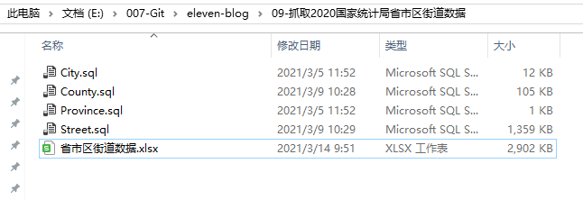
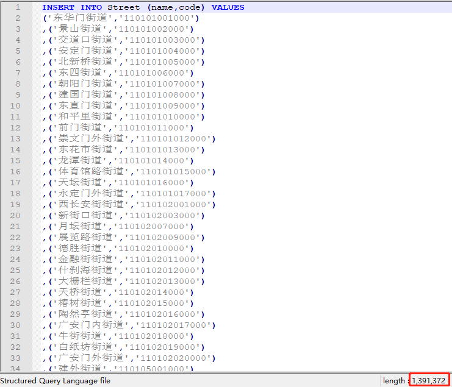
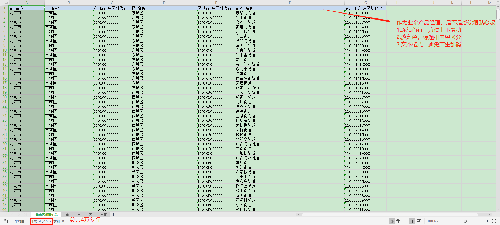

[toc]

### 1.创建表结构

```sql
-- 省
CREATE TABLE `province` (
  `id` int(10) unsigned NOT NULL AUTO_INCREMENT COMMENT '省-序号',
  `name` varchar(255) CHARACTER SET utf8mb4 COLLATE utf8mb4_general_ci DEFAULT NULL COMMENT '省-名称',
  `code` int(11) DEFAULT NULL COMMENT '省-统计用区划代码',
  PRIMARY KEY (`id`)
) ENGINE=InnoDB AUTO_INCREMENT=32 DEFAULT CHARSET=utf8mb4 COLLATE=utf8mb4_general_ci
;
-- 市
CREATE TABLE `city` (
  `id` int(10) unsigned NOT NULL AUTO_INCREMENT COMMENT '市-序号',
  `name` varchar(255) CHARACTER SET utf8mb4 COLLATE utf8mb4_general_ci DEFAULT NULL COMMENT '市-名称',
  `code` varchar(255) CHARACTER SET utf8mb4 COLLATE utf8mb4_general_ci DEFAULT NULL COMMENT '市-统计用区划代码',
  PRIMARY KEY (`id`)
) ENGINE=InnoDB AUTO_INCREMENT=343 DEFAULT CHARSET=utf8mb4 COLLATE=utf8mb4_general_ci
;
-- 县
CREATE TABLE `county` (
  `id` int(10) unsigned NOT NULL AUTO_INCREMENT COMMENT '县-序号',
  `name` varchar(255) CHARACTER SET utf8mb4 COLLATE utf8mb4_general_ci DEFAULT NULL COMMENT '县-名称',
  `code` varchar(255) CHARACTER SET utf8mb4 COLLATE utf8mb4_general_ci DEFAULT NULL COMMENT '县-统计用区划代码',
  PRIMARY KEY (`id`)
) ENGINE=InnoDB AUTO_INCREMENT=3272 DEFAULT CHARSET=utf8mb4 COLLATE=utf8mb4_general_ci
;
-- 街道
CREATE TABLE `street` (
  `id` int(10) unsigned NOT NULL AUTO_INCREMENT COMMENT '街道-序号',
  `name` varchar(255) CHARACTER SET utf8mb4 COLLATE utf8mb4_general_ci DEFAULT NULL COMMENT '街道-名称',
  `code` varchar(255) CHARACTER SET utf8mb4 COLLATE utf8mb4_general_ci DEFAULT NULL COMMENT '街道-统计用区划代码',
  PRIMARY KEY (`id`)
) ENGINE=InnoDB AUTO_INCREMENT=41537 DEFAULT CHARSET=utf8mb4 COLLATE=utf8mb4_general_ci
```

### 2.省、市、县、街道的数据

| 省   | 31   |
| ---- | ---- |
| 市   | 342  |
| 县   | 3271 |
| 街道 | 4153 |

`注：数据截止到2020-11-06(官网最新)`

### 3.数据SQL

```sql
dbo.Province	-- 省

dbo.City		-- 市

dbo.County		-- 县

dbo.Street		-- 街道
```

考虑到小伙伴们的需求，我弄成了2种格式，一种是SQL形式；一种是Excel形式，是不是很细心呢？





为了方便小伙伴们阅读，我写了联合查询，是不是看起来很顺心呢，附上联合查询语句，对应的Sheet是下方截图哦，不想手动操作的小伙伴，可以直接白嫖哦

```sql
SELECT province.name,city.name,city.code,county.name,county.code,street.name,street.code FROM street
JOIN county
ON LEFT(street.code, 6) = LEFT(county.code, 6)
JOIN city
ON LEFT(city.code, 4) = LEFT(county.code, 4)
JOIN province
ON province.code = LEFT(city.code, 2)
order by province.code
```



废话不多说，公众号回复：==`全国`==。即可获取下载链接哦。

### 4.源码

源码双手奉上，喜欢的小伙伴们记得点点关注哦。

```python
# -*-coding:utf-8 -*-
import requests
import pymysql
from bs4 import BeautifulSoup as bs
import time

# 为了避免被网站监测出是爬虫，伪装成浏览器，加入代理更无解
def get_url_content(url):
    i_headers = {
        "User-Agent": "Mozilla/5.0 (Windows NT 10.0; Win64; x64) AppleWebKit/537.36 (KHTML, like Gecko) Chrome/83.0.4103.61 Safari/537.36", \
        "Referer": 'http://www.stats.gov.cn/tjsj/tjbz/tjyqhdmhcxhfdm/'}
    req = requests.get(url, headers=i_headers)
    # proxies = {"http": "114.244.112.220:8118"}  # 设置你想要使用的代理
    # proxy_s = urllib2.ProxyHandler(proxies)
    # opener = urllib2.build_opener(proxy_s)
    # urllib2.install_opener(opener)
    return req.content.decode('gbk')

# 请求所访问的网站
html_data = get_url_content('http://www.stats.gov.cn/tjsj/tjbz/tjyqhdmhcxhfdm/2020/index.html')

sup = bs(html_data, 'html.parser')
attrs = {
    "class": "provincetr"
}
city_attrs = {
    "class": "citytr"
}
area_attrs = {
    "class": "countytr"
}
town_attrs = {
    "class": "towntr"
}
baseUrl = 'http://www.stats.gov.cn/tjsj/tjbz/tjyqhdmhcxhfdm/2020/';

# pymysql
conn = pymysql.connect(
    host="127.0.0.1",
    port=3306,
    user="root",
    password="123456",
    database="tool_back",
    charset="utf8")
cursor = conn.cursor()
start = time.time() # 开始时间，便于统计耗时
data_tables = sup.find_all('tr', attrs)     # 查找所有的tr
# 全部省，如河北、河南、内蒙古...
for mytr in data_tables:
    print("省份", mytr)
    mya = mytr.find_all('a');
    # 省，每次循环遍历一个省
    for sa in mya:
        print(sa.contents[0]);
        add = sa['href'][:-5];
        city_data = get_url_content(baseUrl + sa['href']);
        citys = bs(city_data, 'html.parser').find_all('tr', city_attrs);
        # 市，如石家庄市、保定市...每次循环遍历一个市
        for city in citys:
            city_a = city.find_all('a');
            sql = 'insert into city(code,name) values(%s,%s);'
            cursor.execute(sql, [city_a[0].contents[0], city_a[1].contents[0]])
            area_data = get_url_content(baseUrl + city_a[0]['href'])
            areas = bs(area_data, 'html.parser').find_all('tr', area_attrs)
            # 县（区），如北京的东城区、西城区...每次循环遍历一个县（区）
            for area in areas:
                area_a = area.find_all('a')
                print(area_a)
                # 如果在a标签中有这个县，就走这个循环
                if area_a:
                    sql = 'insert into county(code,name) values(%s,%s);'
                    cursor.execute(sql, [area_a[0].contents[0], area_a[1].contents[0]])

                    town_data = get_url_content(baseUrl + add + '/' + area_a[0]['href'])
                    towns = bs(town_data, 'html.parser').find_all('tr', town_attrs);
                    # 街道，如北京的东华门街道、景山街道...每次循环遍历一个街道
                    for town in towns:
                        town_a = town.find_all('a');
                        sql = 'insert into street(code,name) values(%s,%s);'
                        cursor.execute(sql, [town_a[0].contents[0], town_a[1].contents[0]])
                # 如果a标签没有，那么就去td标签中找
                else:
                    area_td = area.find_all('td');
                    # 街道
                    sql = 'insert into county(code,name) values(%s,%s);'
                    cursor.execute(sql, [area_td[0].contents[0], area_td[1].contents[0]])

print('完成数据爬取!')
end = time.time()
print(end - start)  # 计算耗时时间，其实加一个装饰器更好
conn.commit()   # 提交到数据库中
conn.close()    # 关闭连接

```

